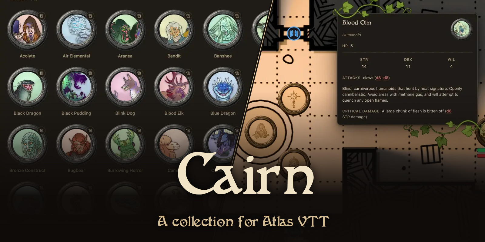

# Cairn for Atlas VTT

[Cairn](https://cairnrpg.com) by Yochai Gal as a collection for [Atlas VTT](https://github.com/ByteMirror/atlas-vtt), the virtual tabletop plugin for Obsidian. Import one file and you have the creatures, the rules, the items and a starting adventure that is set up to play.

  

Yochai Gal and Oozejar allowed me to publish this collection. Thank you both.

## What you get

- The 145 creatures of the Cairn bestiary as tokens, each with its statblock. The art is by Oozejar.
- The Cairn 2e rules as notes: the Player's Guide, the Warden's Guide and the backgrounds.
- 549 items as a loot table for the loot roller.
- The starting adventure Rise of the Blood Olms on the scene Blue Mouth Caves. The scene has walls and doors, a pin on every room that opens its part of the adventure, pins for the treasure, and the creatures in their places with their statblocks.
- Ten class tokens for player characters.
- The Cairn game system for the collection: HP and STR bars on every token, the Cairn conditions, and a d20 that you roll under.

## Install

You need Obsidian with [Atlas VTT](https://github.com/ByteMirror/atlas-vtt) 0.5.0 or newer and [Fantasy Statblocks](https://github.com/javalent/fantasy-statblocks).

1. Click the download button at the top of this page. You get the file `Cairn v2.atlas-collection.zip`. Do not unpack it.
2. In Obsidian, run the command **Open scene browser**. In the sidebar, click **Import collection** and choose the file. Check the list and click **Import**.
3. Download [`Cairn.layout.json`](fantasy-statblocks/Cairn.layout.json). In the settings of Fantasy Statblocks, import it under **Layouts**, and switch on **Automatically Parse Frontmatter for Creatures**. Without these two the statblocks show empty.
4. Open the scene **Blue Mouth Caves** and put the tokens of your party on the map.

The adventure is the scene's DM note, and every numbered pin opens the room with that number.

The scene comes without lighting. To play the caves in the dark, press <kbd>Space</kbd> on the map, go to **Experimental features** and switch on **Dynamic lighting**. Then switch on **Dynamic lighting** for the scene in the **Lighting options** of the toolbar, and give the tokens of the party vision and a torch. The walls and doors are already in the scene.

## The adventure and this map

Rise of the Blood Olms has a map of its own, but only the text of the adventure is under a free licence. Here it is played on another map, so the rooms lie in other places. Each room in the note says where it is on this map, and a few compass directions in the text were changed to fit. The section "Using the map" in the note was added. The rest is the original text.

Five creatures of the adventure are not in the bestiary and have no art of their own. Their tokens show bestiary art by Oozejar: the Olm has the Kobold's, the Blood Olm the Reptilian's, Rusal the Dwarf's, High Lector Geteli the Acolyte's and Jhel-Fries the Elf's.

## Credits

- Cairn, its rules, bestiary and items, and the adventure CAS-2: Rise of the Blood Olms: written by [Yochai Gal](https://cairnrpg.com), licensed under [CC BY-SA 4.0](https://creativecommons.org/licenses/by-sa/4.0/). The adventure was edited by Derek B. The texts were converted to Obsidian notes and Fantasy Statblocks notes; each note names its source.
- Creature art: [Oozejar](https://oozejar.com), from the [Illustrated Bestiary](https://gourdin-konbo-club.itch.io/illustrated-bestiary) published by Gourdin Konbo Club, licensed under [CC BY-SA 4.0](https://creativecommons.org/licenses/by-sa/4.0/). The drawings were cropped to round tokens and set on a tinted background.
- Class tokens: icons by [Sketch Studio](https://www.fiverr.com/sketchstudioart), commissioned by Maatlock of [maatlockstavern.com](https://maatlockstavern.com), licensed under [CC BY 4.0](https://creativecommons.org/licenses/by/4.0/). They were redrawn as pencil sketches and placed on a parchment background.
- Map: made with [One Page Dungeon](https://watabou.itch.io/one-page-dungeon) by watabou.

## Licence

This collection is licensed under [CC BY-SA 4.0](LICENSE). The class tokens keep their CC BY 4.0 licence.

This is not an official Cairn product.
